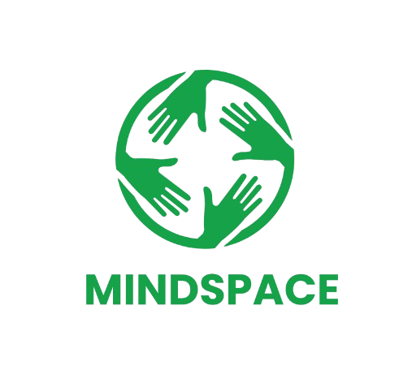
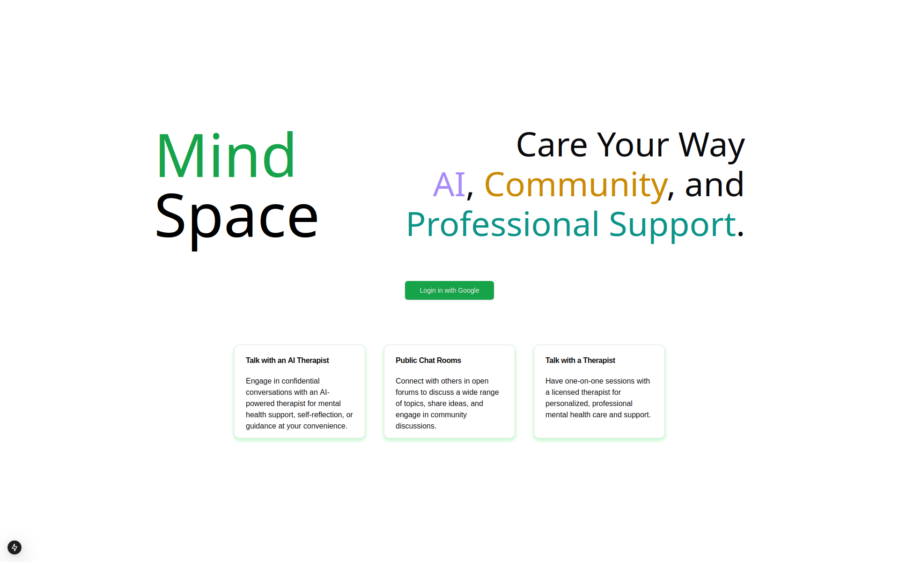
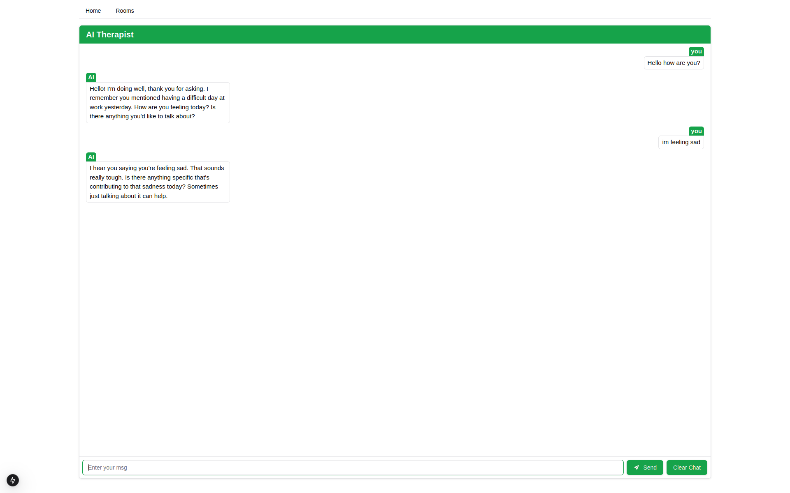
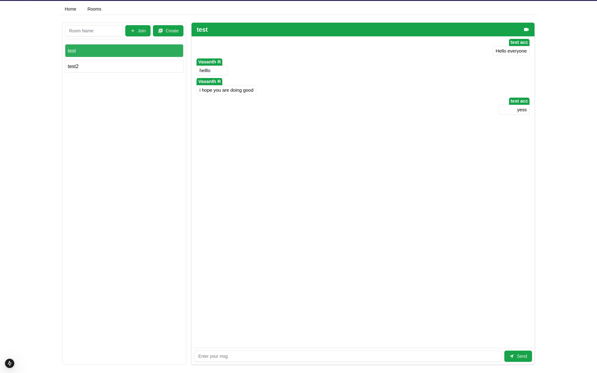
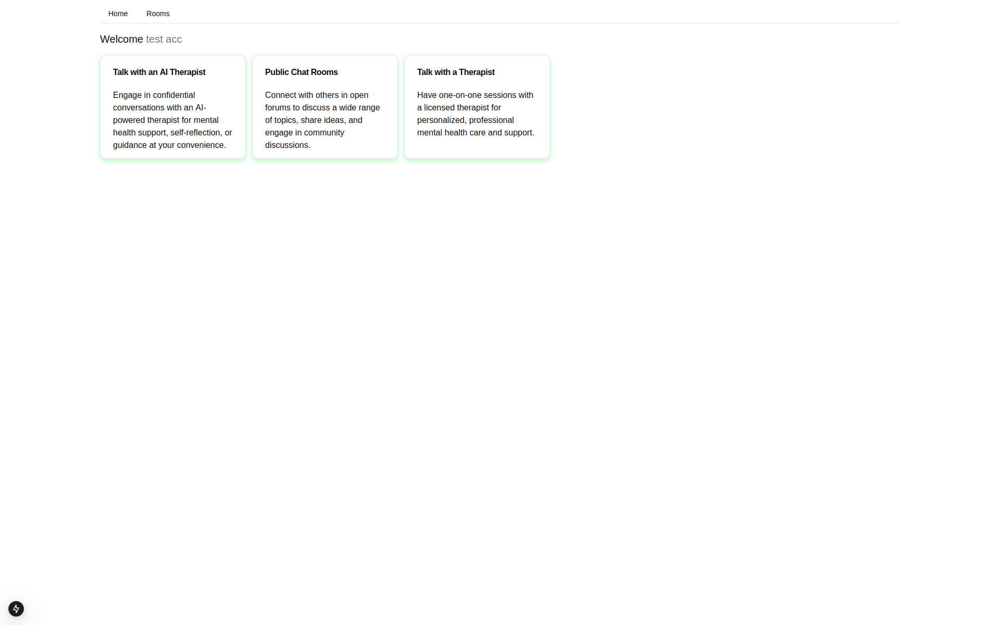

# MindSpace

  
  

  A platform that ensures that no one is left unheard.
  

## Contents

- [**Overview**](#overview)
- [**Gallery**](#gallery)
- [**Team Memebers**](#team-members)

## Overview

MindSpace is an innovative app designed to support mental well-being through:

- AI Therapist: Confidential, AI-powered therapy for self-reflection and mental health guidance.
- Public Chat Rooms: Community forums to connect, share ideas, and discuss diverse topics.
- Licensed Therapists: One-on-one sessions with professionals for personalized care and support.

MindSpace blends technology and human expertise to foster meaningful conversations and mental health support.

## Gallery

| Home|AI Therapist|
:-:|:-:
|  |  |

| Virtual Therapy Groups|User Dashboard |
:-:|:-:
|  |  |

## Team Members

  
|  |  |
:-:|:-:
|Aaron George Abraham|Eshaan Abdulkalam|
|<a href="https://github.com/aaron-6960">@aaron-6960</a>|<a href="https://github.com/Eshaanmanath">@Eshaanmanath</a>|

| |  |
:-:|:-:
|Midhun Unni|Vasanth R|
|<a href="https://github.com/midhununni457">@midhununni457</a>|<a href="https://github.com/1337kid/">@1337kid</a>|

